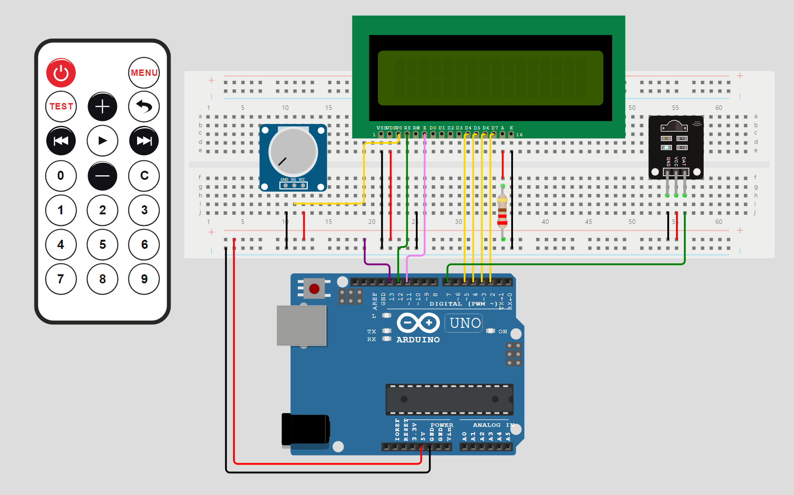

# arduino-testing

This repository is a demonstration of the Unity testing framework
to automate tests against an Arduino Uno (REV3).

## The Game - 2048

The program that runs against the Arduino is "2048". You can play
the game for free in many places online,
[such as here](https://www.2048.org/).

This what it looks like! 😃


Since the LCD display has only 16 x 2 cells, the 4 x 4 grid
used in 2048 is split in half, with the top half of the grid
on the left, and the bottom half on the right.

Surprisingly, I think you'll get used to this pretty quickly.


It's in a tub to protect the wires from my cat btw... 🐈

After going past `8`, numbers are changed to what looks roughly
like a battery that fills up. A full battery is `1024`
and so when you combine two of these, you win!

I'll let you put in the work to reach that screen - it takes a while!

## Components

This diagram, generated using the Wokwi simulator, illustrates the
setup:



Please see the diagram for exact Pins. Roughly in words:

1. Arduino Uno REV3.
2. 16 x 2 LCD display.
3. Potentiometer to tune the LCD display's backlight.
4. A 220ohm resistor for the LCD display
5. Infrared Receiver.
6. Infrared Remote Control. 

The remote control I tuned the program to is ELEGO's:


Different remotes use different control codes, so if you want to use
a different one, please tweak the `Input` library appropriately.

The controller in the Wokwi Simulator will also work, so you can
run and play the game in Wokwi's Simulator without a physical Arduino.

## Architecture

This repository is here to demonstrate automated embedded testing. The technologies involved are:

* [Unity Testing Framework](https://www.throwtheswitch.org/unity)
  by Throw The Switch.
* [CMock](https://www.throwtheswitch.org/cmock) by Throw The Switch.
* [PlatformIO](https://platformio.org/) in 
  [Visual Studio Code](https://code.visualstudio.com/Download).

To build you will also need some kind of `make` and `ruby`. Make sure
you go into the CMock directory and run `bundle install` to install
all the required Gems.

> [!WARNING] 
> I used `ruby 2.7.8p225` - I have not tested v3.

If you install platform IO, you can build and upload the game under the
`uno` environment.

The `remote_tests` environment is for running tests on the
Arduino Uno itself. The `local_tests` environment is for running
tests on your desktop / local machine.

> [!TIP]
> You could connect the remote tests to an Arduino simulator. 

## How Does it Work?

We make use of two Ruby scripts to simplify our testing:

> **Unity Test Runner Generator** - auto generates a test harness to run our tests.

These appear as `*_Runner.cpp` files in the `test` 
folder next to each test file. This is a small
portion of what this file contains:

```c
/*=======MAIN=====*/
int main(void)
{
  UnityBegin("test/local/test_start_scene/test_start_scene.cpp");
  run_test(test_can_go_to_play_scene_with_almost_any_button, "test_can_go_to_play_scene_with_almost_any_button", 24);

  return UNITY_END();
}
```

The runner is responsible for:

1. Running each test case.
2. Running the suite setup, suite teardown, test setup, and test teardown at the right time.
3. Setting up and tearing down the mocks in use.

This is a lot of hassle to maintain manually, but
with these scripts you do not have to worry! 😊

> **CMock Generator** - auto generates mocks for use in tests.

Mocks let us create fake versions of functions, such as faking user input.

The mock generator creates various "Expect" functions that let us assert
mocks are called with the right arguments, at the right time, and we
can instruct them to return the right values.

A sample of this auto generated file is:

```c
void get_current_lcd_state_CMockStopIgnore(void)
{
  if(Mock.get_current_lcd_state_IgnoreBool)
    Mock.get_current_lcd_state_CallInstance = CMock_Guts_MemNext(Mock.get_current_lcd_state_CallInstance);
  Mock.get_current_lcd_state_IgnoreBool = (char)0;
}
```
These files are big and definitely not a good idea to write by hand!

When our tests run locally, they mock the Graphics library / LCD
screen, and user input. When run "remotely", or in other words, on the Arduino Uno, we only mock user input.

When compiling a test, all source code possible is included in
compilation. Platform IO uses "LTO" or 
[link time optimisation](https://gcc.gnu.org/wiki/LinkTimeOptimization)
by default, so the binary we upload is not unnecessarily large
because of this.

This means we are not really unit testing, but **integration testing**.

Whatever you'd like to call it, we can test the whole program
through C working together, just mocking the "edges" of our code - the parts
we can't auto-execute, like user input or the physical display.

Please see the `test` folder inside `2048` for many examples. 😊

> [!NOTE]
> The code "pretends" the Graphics library can only run on the 
  remote and that it can magically read the LCD screen. This is
  faked but it makes for a more interesting test demo. Just
  imagine the hardware is more mysterious and unreliable. 🪄

I just want to quickly shout out `FFF` - the 
[Fake Function Framework](https://github.com/meekrosoft/fff). This can also
be used and managed by Unity.

See also [Ceedling](https://github.com/ThrowTheSwitch/Ceedling) for more info.

## Test Example

Here is a quick breakdown of one of our tests:

```c
/**
 * @brief Verify that the game is considered won as soon as 2048 is made.
 */
void test_detects_won_position()
{
    /* Set up game to be won */
    grid->cells[0][0] = 1024;
    grid->cells[1][0] = 1024;

    /* Win the game */
    add_random_number_to_grid_Expect(grid);
    use_win_characters_Expect();
    update_play_scene(&game_state, BUTTON_LEFT);

    /* Check we are on the win screen */
    TEST_ASSERT_EQUAL(SCENE_WIN, game_state.scene);
}
```

Step by step here is what is happening:
1. We set up the `grid` - the 2048 grid - with some dummy data. Two 1024 cells.

```c
/* Set up game to be won */
grid->cells[0][0] = 1024;
grid->cells[1][0] = 1024;
```

2. We `Expect` some calls to happen.

```c
add_random_number_to_grid_Expect(grid);
use_win_characters_Expect();
```

This is `CMock`'s mocks. We mock both the `random` library and the `Graphics` library here.

We don't especially care these are called, but we need to tell `CMock` ahead of time we expect this, so it does not fail the test.

3. We call `update_play_scene` "simulating" the user
   hitting the left button.

```c
update_play_scene(&game_state, BUTTON_LEFT);
```

Since we've placed two `1024`'s next to each other,
this should make `2048` and so win the game!

4. Finally we assert (check) that the scene
   displayed is the win scene!

```c
/* Check we are on the win screen */
TEST_ASSERT_EQUAL(SCENE_WIN, game_state.scene);
```

That's the basics; have fun! 😃